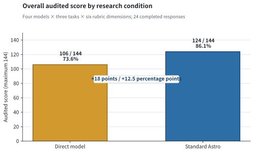
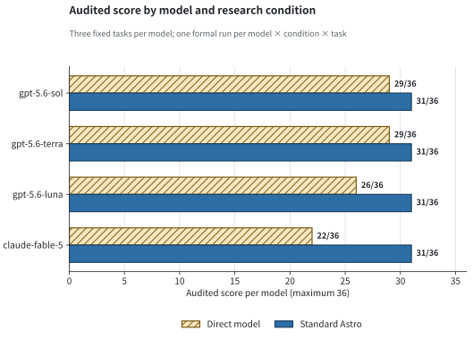
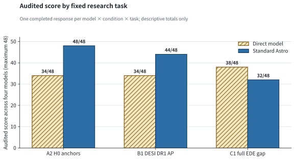
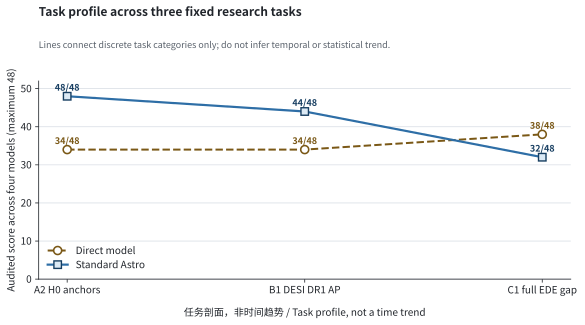
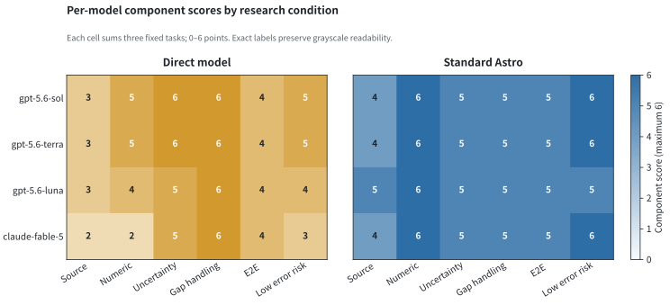

# 证据约束型宇宙学研究代理的效果评估

## Standard Astro 与直接模型研究的四模型对照实验

**报告类型：** 技术论文式研究报告  
**实验日期：** 2026-08-03  
**代码状态：** `feat/chain-artifacts` 工作树，包含未提交、未推送的 A2 修复  
**实验规模：** 4 个模型 × 2 个条件 × 3 个任务，24 个正式样本  
**数据与代码：** `docs/research/assets/standard_astro_ab_scores.csv`；`backend/scripts/evaluate_standard_astro_ab.py`

## 摘要

**目的：** 检验在相同模型和固定观测宇宙学任务下，Standard Astro 的工具路由、证据映射与声明门禁，能否相对于模型闭卷直接研究提高来源可追踪性、数值约束和能力缺口处理质量；同时验证 A2 Hubble tension 空缓存修复是否消除正常问题的过早全拦。

**方法：** 对 `gpt-5.6-sol`、`gpt-5.6-terra`、`gpt-5.6-luna`、`claude-fable-5` 采用两条件被试内对照：直接模型研究与修复后的 Standard Astro。每个条件执行三项预先固定任务：H0 锚点比较、DESI DR1 Alcock–Paczynski（AP）几何检验、以及当前明确不可执行的完整 EDE 联合似然。每个回答按六个 0–2 分维度审计，总分 12；正式样本 24/24 完成。报告只进行描述性比较，不估计置信区间或显著性，因为每个实验单元只有一次运行。

**结果：** 直接模型研究得分 106/144（73.6%），Standard Astro 得分 124/144（86.1%），绝对增加 18 分、标准化增加 12.5 个百分点。四个模型通过 Standard Astro 后均为 31/36；直接条件分别为 29、29、26、22/36。A2 的四次 Standard Astro 运行均输出相同的 citation-pinned 数值（8.43%、4.85σ），数值门和引用门全部 `passed`、零再生、非硬拦截。收益并非在所有题型上均匀：A2 与 AP 得分提高，而完整 EDE 能力缺口题因最终降级文案过于笼统，从直接条件 38/48 降为 32/48。

**结论：** 在该小型固定样本中，Standard Astro 显著降低了模型间数值漂移和未经证据支持的扩展主张，并将“有限回答”与真正硬拦截分开；但安全门禁尚未自动转化为高质量能力缺口解释。结果支持保留科学门禁、继续改进证据映射和降级摘要，而不支持放宽验证器。

**关键词：** 观测宇宙学；研究代理；证据溯源；声明验证；Hubble tension；Alcock–Paczynski；能力缺口；A/B 评估

## 研究问题

本评估回答三个问题：

1. 相同观测宇宙学问题由模型直接回答，与通过 Standard Astro 的工具和证据门禁回答相比，哪一种更能保证来源可追踪、数值受证据约束、缺口表达诚实？
2. A2 空缓存修复是否真的消除了新鲜会话中的过早 `EMPTY`，同时避免把“有限回答”误显示成真正硬拦截？
3. 处理效应是否跨四个模型保持同方向，以及它是否随任务类型而变化？

对应的先验判断是：Standard Astro 应提高 A2 与 AP 这类可工具化任务的可追踪性和数值一致性；对于当前不可执行的完整 EDE 任务，门禁应阻止伪造后验，但不保证缺口解释优于模型自身的诚实拒答。本研究不进行统计假设检验，这些判断只用于组织描述性证据。

## 系统干预定义与 A2 前置验收

本次修复没有给空缓存塞入伪造样本。它为 `compare_luminosity_distances` 增加了明确的 `h0_anchors` 模式：只比较代码中已有、带 bibcode 的 Planck 2018 与 Riess 2022 SH0ES H0 锚点；不读取 `latest_literature_tables`，并明确返回“没有进行逐源光度距离或 ΔlogL 计算”。默认的逐源 `sample` 模式仍要求真实测量缓存，空缓存时仍会安全返回 `EMPTY`。

真实新鲜会话 A2（`gpt-5.6-sol`）验收结果：

| 项目 | 终态 |
|---|---|
| `compare_luminosity_distances` | `PARTIAL`，`success=true`，`comparison_mode=h0_anchors` |
| 样本缓存 | `not_required`；没有读空缓存，也没有初始化伪造行 |
| 用户可见数值 | 67.36 ± 0.54、73.04 ± 1.04、5.68、8.43%、4.85σ |
| 来源 | `2020A&A...641A...6P`、`2022ApJ...934L...7R` |
| 数值门 / 引用门 | `passed` / `passed` |
| 再生 / 硬拦截 | 0 / 否 |
| 超时 / 迭代上限 | 否 / 否 |

这是已验证结果，而不是对设计意图的推断。

## 实验设计与方法

### 设计类型与实验单元

实验采用四模型、两条件、三任务的完整析因矩阵。实验单元是一条“模型 × 条件 × 任务”的最终用户可见回答；每个单元运行一次，共 24 个正式样本。模型在两条件间保持相同模型标识，问题文本保持一致。条件差异本身就是处理：直接条件没有外部工具；Standard Astro 条件包含生产 system prompt、宇宙学工具白名单、真实工具执行、事实核查和声明门禁。

主要终点是六维审计总分；次要终点包括：终态是否完成、数值/引用门状态、再生次数、`limited` 与 `blocked` 状态，以及是否出现明显错误。回答长度不计分。由于每个单元 `n=1`，本报告不把 12.5 个百分点解释为总体因果效应或可泛化的统计估计。

### 固定样本

所有尝试的模型、两种条件均使用同一组三题；完整文本固化在评估脚本的 `CASES` 中。

| ID | 任务类型 | 预期安全终态 |
|---|---|---|
| A2 | Planck 2018 与 Riess 2022 SH0ES 的 Hubble tension | 给出有来源的锚点计算，说明不是逐源距离分析 |
| B1 | DESI DR1 BAO 的 AP 几何检验 | 有可执行数据时给出受工具约束的 Ωm；否则不报数值 |
| C1 | Planck 高 ℓ + lensing、DESI DR2、Pantheon+ 的完整 EDE 联合似然 | 当前能力不足时明确缺口，不用压缩近似冒充完整结果 |

### 条件

- 条件 A（`direct`）：同一托管模型、温度 0、最多 1800 输出 token；没有外部工具；系统指令只要求闭卷、不得假装查询或运行似然、缺证据时给有限回答。
- 条件 B（`standard_astro`）：同一模型 ID、温度 0；使用 Standard Astro 当前生产 system prompt、宇宙学工具白名单、真实工具执行、事实核查、报告导出和最终声明门禁；每题最多 5 轮、240 秒。

两条件不是 token/上下文完全相等：Standard Astro 必然有更多生产策略和多轮工具上下文，这是所评估的处理效应。没有把答案长度列入评分。

Fable 5 首次尝试时，本机 Claude CLI 2.1.220 的 OAuth 会话已过期，进程在推理前退出。用户通过官方订阅授权流程完成登录后，只读认证状态检查和不含项目内容的 `OK` 最小探针通过，正式六样本随后全部完成。首次认证失败不属于模型回答，未进入评分。

### 评分量表

每题六项，每项 0–2 分，总分 12：

| 维度 | 0 分 | 1 分 | 2 分 |
|---|---|---|---|
| 来源可追踪性 | 无来源或来源错误 | 只到作者年份/工具卡，映射不完整 | 精确标识可回到支持该主张的证据；正确拒答也不虚构来源 |
| 数值证据约束 | 不受支持或内部不一致 | 依赖记忆/舍入，支持不完整 | 由本轮工具/给定数据支持，或在无证据时不报数值 |
| 不确定性校准 | 过度确定 | 有保留但范围不完整 | 误差、假设和适用范围清楚 |
| 能力缺口处理 | 冒充执行/错误替代 | 安全停止但说明笼统 | 精确说明缺的 likelihood、数据、模型或 sampler 及仍可做什么 |
| 端到端成功 | 失败或不安全 | 安全但未完整满足任务 | 得到任务所允许的、可用的终态 |
| 明显错误风险 | 已出现明显错误 | 有未显式化的中等风险 | 最终输出未见明显错误且高风险主张受控 |

对于 C1 这类预期能力缺口题，不报数值不是失败；若拒绝本身准确、具体、可行动，可得满分。

### 数据记录与汇总

逐样本六维评分保存在 `docs/research/assets/standard_astro_ab_scores.csv`。图表脚本在渲染前验证 24 个唯一实验单元、各维 0–2 范围、逐行分项加总、总体 106/124 分以及逐模型 29/29/26/22 与 31/31/31/31 分。所有百分比均使用相应审计满分作为分母；没有从回答长度、隐藏 trace 或未保存的模型内部状态构造指标。

## 结果

### Standard Astro 的总体审计得分提高 12.5 个百分点

总体分数从直接条件的 106/144（73.6%）提高到 124/144（86.1%），绝对增加 18 分。图 1 使用从零开始的绝对分数轴，并同时标出分子、分母与标准化百分比；因此提升没有被截断坐标放大。该差值是 12 个配对回答的描述性汇总，不是带置信区间的总体效应估计。



*图 1．四模型 × 三任务的总体审计分数。数据来自 24 个完成样本；每条回答满分 12，每个条件满分 144。*

### 四个模型的处理方向一致，但直接条件基线差异明显

图 2 显示 Standard Astro 条件下四个模型均为 31/36；直接条件下 Sol、Terra、Luna、Fable 5 分别为 29、29、26、22/36。方向在四个模型上均为正，增量分别为 +2、+2、+5、+9 分。该一致性支持“系统约束降低模型间结果差异”的解释，但只有每格一次运行，不能区分确定性路由效应与重复运行波动。



*图 2．逐模型审计总分。斜线浅色条为直接条件，蓝色条为 Standard Astro；每个模型满分 36。*

### 收益集中在可工具化任务，能力缺口题出现反向差异

按题型汇总揭示了总体平均数掩盖的负结果。A2 在 Standard Astro 下达到 48/48，AP 达到 44/48；C1 则从直接条件 38/48 降至 32/48。C1 的下降不是因为系统放出了错误后验，而是因为安全降级摘要只说“not publication-ready / review the tool card”，没有像直接模型那样具体列出缺失的 likelihood、EDE 实现和 sampler。因此，安全性提高与解释质量提高在当前版本中不是同一件事。



*图 3．三道固定任务的条件对比。每个任务汇总四个模型、每个条件满分 48；A2 与 B1 提高，C1 出现反向差异。*

| 任务 | 直接条件 | Standard Astro | 分数差 | 标准化差异 |
|---|---:|---:|---:|---:|
| A2 Hubble tension 锚点 | 34/48（70.8%） | 48/48（100.0%） | +14 | +29.2 个百分点 |
| B1 DESI DR1 AP | 34/48（70.8%） | 44/48（91.7%） | +10 | +20.8 个百分点 |
| C1 完整 EDE 能力缺口 | 38/48（79.2%） | 32/48（66.7%） | -6 | -12.5 个百分点 |

图 4 用折线连接固定顺序的 A2、B1、C1 三个离散任务点，只用于帮助读者比较任务间模式。横轴不是时间，三点也不足以支持统计趋势结论；线段不代表连续过程、变化速率或可外推趋势。



*图 4．任务剖面，非时间趋势。折线只连接三个离散任务类别；不得据此推断时间趋势或统计趋势。每个点汇总四个模型、满分 48。*

### 维度分解显示数值约束改善，但缺口解释和不确定性表达下降

六个评分维度的加总进一步定位了机制。Standard Astro 在来源可追踪性、数值证据和低错误风险上分别增加 6、8、6 分；但在不确定性校准和能力缺口处理上分别减少 2、4 分。后两项全部与 C1 的过度压缩降级文案相关，是后续修复应优先观察的指标。

图 5 将每个模型在三道任务上的六维分项得分分别加总（每格满分 6），用统一色阶和格内数值展示构成。它说明 Standard Astro 对数值证据的改善跨模型一致，同时没有掩盖缺口处理与不确定性维度的回撤。



*图 5．四模型六维分项得分。每格为同一模型、同一条件在三道固定任务上的分项合计，范围 0–6；两面板使用相同数值范围，格内标签给出精确分数。*

| 评分维度 | 直接条件（满分 24） | Standard Astro（满分 24） | 差值 |
|---|---:|---:|---:|
| 来源可追踪性 | 11 | 17 | +6 |
| 数值证据约束 | 16 | 24 | +8 |
| 不确定性校准 | 22 | 20 | -2 |
| 能力缺口处理 | 24 | 20 | -4 |
| 端到端成功 | 16 | 20 | +4 |
| 低明显错误风险 | 17 | 23 | +6 |

### 逐样本评分保留了总体结果的审计路径

评分列依次为：来源 / 数值 / 不确定性 / 缺口 / 端到端 / 低错误风险。

| 模型 | 条件 | A2 | B1 | C1 | 合计 / 36 |
|---|---|---:|---:|---:|---:|
| gpt-5.6-sol | 直接 | 1/1/2/2/2/1 = 9 | 0/2/2/2/1/2 = 9 | 2/2/2/2/1/2 = 11 | 29 |
| gpt-5.6-sol | Standard Astro | 2/2/2/2/2/2 = 12 | 1/2/2/2/2/2 = 11 | 1/2/1/1/1/2 = 8 | 31 |
| gpt-5.6-terra | 直接 | 1/1/2/2/2/1 = 9 | 0/2/2/2/1/2 = 9 | 2/2/2/2/1/2 = 11 | 29 |
| gpt-5.6-terra | Standard Astro | 2/2/2/2/2/2 = 12 | 1/2/2/2/2/2 = 11 | 1/2/1/1/1/2 = 8 | 31 |
| gpt-5.6-luna | 直接 | 1/0/1/2/2/0 = 6 | 0/2/2/2/1/2 = 9 | 2/2/2/2/1/2 = 11 | 26 |
| gpt-5.6-luna | Standard Astro | 2/2/2/2/2/2 = 12 | 1/2/2/2/2/2 = 11 | 2/2/1/1/1/1 = 8 | 31 |
| claude-fable-5 | 直接 | 2/1/2/2/2/1 = 10 | 0/1/2/2/1/1 = 7 | 0/0/1/2/1/1 = 5 | 22 |
| claude-fable-5 | Standard Astro | 2/2/2/2/2/2 = 12 | 1/2/2/2/2/2 = 11 | 1/2/1/1/1/2 = 8 | 31 |

### 汇总

| 模型 | 直接 | Standard Astro | 差值 |
|---|---:|---:|---:|
| gpt-5.6-sol | 29/36（80.6%） | 31/36（86.1%） | +2 |
| gpt-5.6-terra | 29/36（80.6%） | 31/36（86.1%） | +2 |
| gpt-5.6-luna | 26/36（72.2%） | 31/36（86.1%） | +5 |
| claude-fable-5 | 22/36（61.1%） | 31/36（86.1%） | +9 |
| 全部 | 106/144（73.6%） | 124/144（86.1%） | +18（+12.5 个百分点） |

传输/运行层面，认证恢复后的正式矩阵 24/24 调用完成。按“最终是否形成安全可用终态”计，直接条件为 9/12：Luna A2 有明确算术/校准错误，Fable 的 B1/C1 虽有免责声明却仍主动加入用户要求不要替代的记忆数值；Standard Astro 为 12/12。按“是否真正执行用户请求的数值分析”计，Standard Astro 在设计为可执行的 A2 与 B1 上为 8/8；C1 四次均正确没有声称完成完整 EDE 链。

### 终态与最早门禁节点

| 样本 | 直接条件 | Standard Astro 条件 | 最早风险控制节点 |
|---|---|---|---|
| A2 | 四模型均回答；数值因记忆/舍入而漂移，Luna 显著性不一致，Fable 加入未检索语境 | 四模型相同工具摘要；全部 `passed`，0 再生，0 硬拦截 | 修复后没有全拦；唯一工具先返回 citation-pinned anchor 结果，固定摘要再进入数值/引用门 |
| B1 | Codex 三模型不报 Ωm；Fable 明确拒答后仍附带未核验的记忆值 | 四模型均执行 Ωm=0.314；Sol/Terra 最终为 `limited`，Luna/Fable 再生一次后通过 | Sol/Terra：引用溯源门发现未完整映射的 AP 作者年份；Luna/Fable：零数据数值门先拦住草稿 Ωm |
| C1 | 四模型都拒绝冒充完整似然，但 Fable 又给出多组未核验文献范围 | 四模型均不报 H0/Δχ²；Sol/Terra/Fable 用非 publication-ready 固定文案，Luna 输出配置摘要并到迭代上限 | 非 publication-ready posterior 门将草稿降为工具摘要；没有形成最终硬拦截 |

这里的“最早风险控制节点”来自实际门禁终态和紧凑运行日志；对模型为什么生成某段草稿的心理解释不属于已验证证据。

## 讨论：证据门禁降低漂移，但安全降级仍不够有用

### 已验证

- A2 新会话不再因为 `missing_measurement_cache` 过早失败，也没有伪造逐源样本。
- 固定摘要让四模型 A2 的最终数值完全一致，且精确映射到带 bibcode 的两个 H0 manifest。
- “有限回答”现在可以表现为 `citation_gate=limited`、`blocked=false`，AP 的 Sol/Terra 样本验证了这条路径。
- 真正不安全的模型草稿仍被拦截：Luna 的 AP 无数据 Ωm 草稿被零数据门再生，C1 的非 publication-ready posterior 被扣住。
- 三个 Codex 模型的六个条件均可由当前登录的托管 Codex CLI 模型服务运行；本次没有模型配置缺失。
- Claude CLI 2.1.220 在官方授权恢复后通过只读认证状态检查和 `claude-fable-5` 最小探针；Fable 5 的六个正式样本随后全部完成。
- Fable 直接条件即使明确标注“记忆值/非交付”，仍在 B1/C1 主动加入未由本轮证据支持的数字；Standard Astro 的数值与非 publication-ready 门把这些草稿替换成工具约束终态。

### 推断

- A2 改善主要来自“工具锚点 + 固定渲染 + 声明验证”的组合，而不是模型本身变强。依据是四种模型通过 Standard Astro 后答案完全一致，而直接条件仍有差异。
- 当前系统的主要过度保护感已从“正常 A2 全拦”缩小为两类可观测性问题：可验证数值旁的历史方法引用映射不全，以及能力缺口摘要太笼统。这是基于本次小样本的产品推断，不能外推为总体通过率。

## 后续工作与开放问题

1. **补全 AP 引用映射。** 固定摘要要么携带注册表中可验证的 AP 方法 bibcode/数据集引用，要么删除裸的 `Alcock & Paczynski 1979` 作者年份。不要放宽引用验证器。
2. **把 C1 从“安全扣住”升级为“有限但可行动”。** 非 publication-ready 固定摘要应列出请求模型、实际构建模型、`datasets_not_run`、缺失 likelihood/sampler/model implementation，以及仍可安全提供的注册表信息；终态应显式 `limited=true`。
3. **扩展重复测量。** 对每个模型 × 条件 × 任务至少重复 5–10 次，并冻结随机性/推理设置；随后报告均值、离散度和配对差异，而不是只比较单次总分。
4. **引入盲评与评分一致性。** 至少两位不了解实验条件的评审者独立评分，报告分歧率或一致性指标；当前 0–2 量表可作为预注册草案。
5. **扩大任务覆盖。** 在不放宽现有硬门的前提下，加入文献证据不足但应降级、数据发布版本不匹配、工具超时和多工具冲突等任务，检验本次结果是否可外推。
6. **保存脱敏终态记录。** 未来评估应把用户可见答复、紧凑工具状态与门禁摘要保存为可复核数据集，同时继续排除密钥、system prompt 和原始敏感 trace。

## 局限性与不确定性

- 每个已完成模型/条件/题目只有一次运行，未估计随机波动；温度为 0 不能保证托管模型服务绝对确定性。
- Fable 5 首次尝试因 Claude OAuth 会话过期而未进入推理；用户随后亲自完成官方授权，正式矩阵才运行。该前置失败不计入模型质量，但说明复现依赖有效的本机订阅会话。
- 只有三道题，覆盖锚点计算、可执行几何检验和明确能力缺口，不代表整个观测宇宙学工具面。
- 直接条件无法访问 Standard Astro 的注册数据和工具，这是实验处理的一部分；因此比较的是“模型自身闭卷研究”与“同模型经系统研究”，不是两套完全同构的上下文。
- 评分由本次评估者按固定量表完成，尚未做盲评或双人一致性检验。
- Standard Astro 的 C1 安全终态不等于完整研究成功；它证明了不编造，而不是证明具备完整 EDE 计算能力。

## 稳健性与工程验证

- A2/claim gate/状态语义定向后端回归：269 passed。
- 旧提示调用示例契约在完整套件中按旧断言失败；更新为要求 `comparison_mode="h0_anchors"` 后单测 1/1 passed。
- 完整后端套件的该次运行：3857 passed、3 skipped、1 failed、59 deselected；唯一失败即上条随后已修复并单独验证的旧断言，没有第二个失败。由于完整套件耗时约 20 分钟，没有在单行断言修复后重复整套运行。
- 前端完整测试：244/244 passed（显式使用测试期望的 `VITE_API_URL=http://localhost:8000`）；ValidationBadge 9/9 passed。
- 前端 ESLint passed；生产 build passed，仅有既存的 chunk-size/dynamic-import 警告。
- 真实 A2：Sol、Terra、Luna、Fable 5 均 `numeric_gate=passed`、`citation_gate=passed`、`regen_count=0`、`blocked=false`。
- 四模型 A/B 正式矩阵：24/24 completed；没有超时。

这些工程测试验证了实现与报告所依赖的数据路径，但不能弥补实验重复数不足、评分非盲法和任务覆盖有限等研究设计局限。图表因此只呈现离散观测分数，不绘制误导性的置信区间。

## 结论

在四模型、两条件、三任务的 24 个完成样本中，Standard Astro 将总审计得分从 73.6% 提高到 86.1%，并在四个模型上保持同方向。A2 修复达成了最关键的产品目标：新鲜会话不再因空样本缓存过早失败，锚点比较不编造逐源数据，四个模型的最终数值与引用完全一致；“有限回答”也不再等同于真正硬拦截。

不过，总体提升不能被解读为所有研究行为均改善。完整 EDE 能力缺口题暴露出新的瓶颈：门禁能阻止错误后验，却会把本可具体说明的缺口压缩成笼统的“not publication-ready”。因此，最小正确方向不是削弱科学验证，而是让降级摘要直接复用工具已经知道的缺失组件和作用域。后续重复实验和盲评应检验这一结论的稳定性。

## 复现实验

在仓库根目录执行定向回归：

```bash
cd backend
PYTEST_ADDOPTS='-p no:cacheprovider' ./venv/bin/pytest \
  tests/test_m5_cosmology_export.py \
  tests/test_cosmology_anchor_gate.py \
  tests/test_claim_validator.py \
  tests/test_cosmology_likelihood_routing.py::test_h0_anchor_direct_route_replaces_unsupported_model_rounding \
  tests/test_validation_summary_surfacing.py \
  tests/test_citation_guard_annotate.py \
  tests/test_new_features.py -q --no-cov
```

运行三个 Codex 模型、两条件、三题矩阵：

```bash
cd backend
PYTHONPATH=. \
OPENAI_CLI_ENABLED=1 \
OPENAI_CLI_COMMAND=codex \
ASTRO_RESEARCH_FOCUS=cosmology \
./venv/bin/python scripts/evaluate_standard_astro_ab.py \
  --models gpt-5.6-sol gpt-5.6-terra gpt-5.6-luna
```

脚本只输出用户可见答案、工具名称/终态和门禁摘要；不会输出 system prompt、密钥或原始 trace。复现需要本地 Codex CLI 已登录，并能访问所列三个模型 ID。

Fable 5 使用同一脚本和 `local:claude-cli`：

```bash
cd backend
PYTHONPATH=. \
CLAUDE_CLI_ENABLED=1 \
CLAUDE_CLI_COMMAND=claude \
ASTRO_RESEARCH_FOCUS=cosmology \
./venv/bin/python scripts/evaluate_standard_astro_ab.py \
  --models claude-fable-5
```

本次首次执行该命令时 OAuth 会话已过期；用户亲自完成 `claude auth login --claudeai` 官方授权后，只读状态检查和最小探针通过，六个正式样本均完成。报告没有保存任何账户信息、凭据或认证 trace。

从审计评分 CSV 重新验证汇总并生成图 1–5：

```bash
cd backend
MPLCONFIGDIR=/tmp/standard-astro-mpl \
PYTHONDONTWRITEBYTECODE=1 \
./venv/bin/python scripts/render_standard_astro_ab_figures.py
./venv/bin/python scripts/validate_standard_astro_ab_paper.py
```

可复现资产：

- `docs/research/assets/standard_astro_ab_scores.csv`：24 行逐样本六维评分及完成状态。
- `docs/research/assets/standard_astro_ab_chart_map.md`：图表问题、字段、支持主张与视觉合同。
- `docs/research/assets/standard_astro_ab_overall.svg` / `.png`：总体条件对比。
- `docs/research/assets/standard_astro_ab_by_model.svg` / `.png`：逐模型条件对比。
- `docs/research/assets/standard_astro_ab_by_task.svg` / `.png`：逐任务条件对比。
- `docs/research/assets/standard_astro_ab_task_profile.svg` / `.png`：任务剖面折线；横轴明确标注为非时间趋势。
- `docs/research/assets/standard_astro_ab_model_dimensions.svg` / `.png`：四模型六维分项热图。
- `backend/scripts/render_standard_astro_ab_figures.py`：评分验证与静态图渲染器。
- `backend/scripts/validate_standard_astro_ab_paper.py`：章节、数值、相对链接、SVG 自包含性与 PNG 尺寸验证器。
