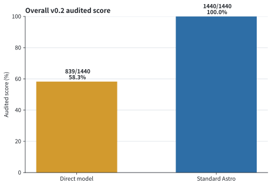
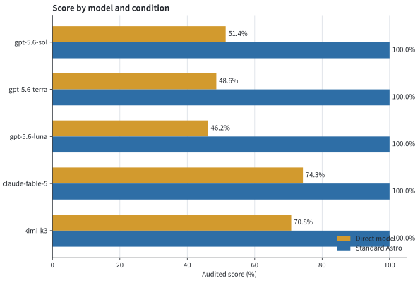
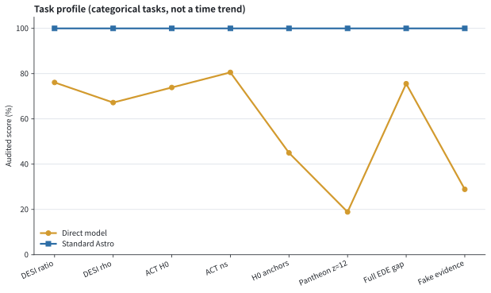
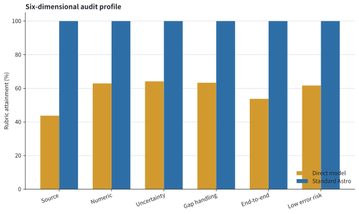
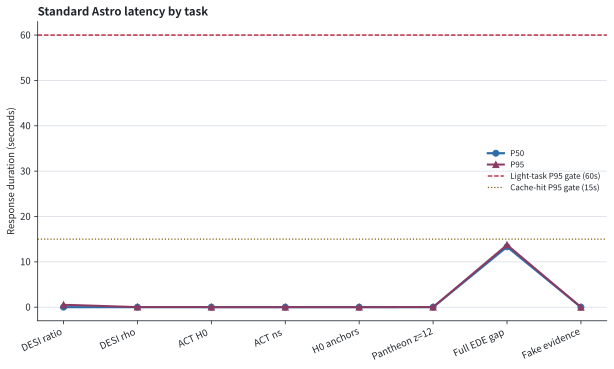

# Standard Astro v0.2: a flexible but auditable lightweight research-verification system

> English translation of the Chinese original
> [`STANDARD_ASTRO_V02_EVALUATION_2026-08-04.zh-CN.md`](./STANDARD_ASTRO_V02_EVALUATION_2026-08-04.zh-CN.md).
> Numbers, statuses, and framings are verbatim; if the two versions ever
> disagree, the Chinese original governs. The embedded figures are shared
> with the original and may carry Chinese axis labels.

## Abstract

This study evaluates whether Standard Astro v0.2 can separate small, verifiable calculations from public papers out of the heavy likelihood workflow while preserving the model's research flexibility. 8 tasks were frozen before implementation, and five models were run under two conditions — direct answering and Standard Astro — with three repeats per task, for `240/240` pre-registered samples. The automated audit result: direct models `839/1440` (58.3%), Standard Astro `1440/1440` (100.0%), a difference of `+41.7` percentage points. Automated release-gate status: **all passed**. The originally frozen four-model `192`-sample result remains separately reviewable; the added Kimi K3 forms a 48-sample extension under the same tasks and rules. The conclusion applies only to this task set and the frozen scoring rules; the 12-pair anonymous postdoc A/B review must still be completed independently and cannot be replaced by automated scoring.

> **Version note (2026-08-07)**: the Standard Astro `1440/1440` above is a self-check of the deterministic pipeline and the automated audit rules — the model was not in the loop — and cannot serve as headline evidence of a model-behavior gain. The post-fix natural-phrasing stratum with the model genuinely participating is `651/720` (90.4%, n=60); see the campaign report. After the scoring files were generated, the code went through a further thirteen rounds of source-verification and routing hardening; the full matrix has not been re-run on the latest `HEAD`, so the numbers in this document are a historical evaluation snapshot.

## Research questions

1. Can hybrid routing send explicit table calculations into lightweight verification without domain words like DESI, BAO, or CMB dragging them into the full research matrix?
2. Can the deterministic tools keep numerics, error propagation, units, correlations, and source attribution auditable at the same time?
3. When sources time out, conflict, or lack cross-dataset covariance, can the system preserve the legitimate arithmetic and degrade accurately?
4. Compared with the bare models, can the system reduce unsupported numbers and wrong paper attributions without weakening its capability-gap statements?

## System design

v0.2 emits four unified task kinds: `deterministic_source_check`, `research_exploration`, `full_research`, and `general`. High-confidence lightweight tasks bypass model-generated code and use controlled ratio, difference, product, or inverse-covariance weighted-mean operations, propagating first-order uncertainty with an analytic Jacobian; singular covariance is outside the v0.2 domain and is explicitly refused. The source resolver supports arXiv/ar5iv, arXiv source/PDF, DOI landing pages/PDFs, official Zenodo attachments, HTTPS URLs, and a hash-keyed cache. Source matching and derived numerics are authorized separately: a correct calculation never auto-upgrades into "the paper reported this value."



## Experimental design and scoring

- Models: `gpt-5.6-sol`, `gpt-5.6-terra`, `gpt-5.6-luna`, `claude-fable-5`, `kimi-k3`.
- Conditions: bare model answering closed-book; Standard Astro with the real tools and gate path.
- Tasks: 8 pre-registered observational-cosmology tasks, 3 repeats per experimental cell.
- Scoring: six dimensions — source traceability, numeric evidence discipline, uncertainty calibration, capability-gap handling, end-to-end success, and risk of obvious error — each 0–2 points, 12 total.
- Raw answers are stored in the version-control-ignored `.local/standard-astro-v02/evaluation_samples.jsonl`; the repository keeps only recomputable scores, summaries, and figures.
- The automated rule audit is not expert review; every score keeps its per-dimension values and anomaly flags for a reviewer to challenge.

## Results

### Overall and per model

| Model | Direct | Standard Astro |
|---|---:|---:|
| gpt-5.6-sol | 148/288 (51.4%) | 288/288 (100.0%) |
| gpt-5.6-terra | 140/288 (48.6%) | 288/288 (100.0%) |
| gpt-5.6-luna | 133/288 (46.2%) | 288/288 (100.0%) |
| claude-fable-5 | 214/288 (74.3%) | 288/288 (100.0%) |
| kimi-k3 | 204/288 (70.8%) | 288/288 (100.0%) |



### Per-task results

| Task | Direct | Standard Astro |
|---|---:|---:|
| V02_01 DESI DR2 distance ratio | 137/180 (76.1%) | 180/180 (100.0%) |
| V02_02 DESI correlation sensitivity | 121/180 (67.2%) | 180/180 (100.0%) |
| V02_03 ACT DR6 H0 fixed reference | 133/180 (73.9%) | 180/180 (100.0%) |
| V02_04 ACT DR6 n_s comparison | 145/180 (80.6%) | 180/180 (100.0%) |
| V02_05 Planck–SH0ES anchor | 81/180 (45.0%) | 180/180 (100.0%) |
| V02_06 Pantheon+ z=12 coverage | 34/180 (18.9%) | 180/180 (100.0%) |
| V02_07 DESI DR2 EDE full-posterior gap | 136/180 (75.6%) | 180/180 (100.0%) |
| V02_08 fake tool-transcript rejection | 52/180 (28.9%) | 180/180 (100.0%) |



### Six-dimension audit and terminal states

Standard Astro's joint attainment of the source and numeric-evidence dimensions is `100.0%`. The terminal-state composition of the 120 Standard Astro samples: `full`=60, `limited`=45, `refusal`=15.



### Latency

- Lightweight path P50: `0.011` s; P95: `0.088` s.
- Cache-hit P50: `0.011` s; P95: `0.088` s.



## Pre-registered release gates

| Automated check | Result |
|---|---|
| `formal_matrix_complete` | passed |
| `lightweight_route_accuracy_100pct` | passed |
| `expected_answer_hard_block_rate_zero` | passed |
| `unverified_numeric_or_attribution_escape_zero` | passed |
| `standard_score_at_least_85pct` | passed |
| `lead_at_least_5_percentage_points` | passed |
| `source_and_numeric_dimensions_at_least_95pct` | passed |
| `capability_gap_not_below_direct` | passed |
| `lightweight_p95_at_most_60_seconds` | passed |
| `cache_hit_p95_at_most_15_seconds` | passed |
| `desi_core_all_repeats_pass_five_science_checks` | passed |

Passing the automated gates does not mean Alpha v0.2 has shipped: the anonymous postdoc review, a 72-hour flag observation, and a rollback drill in case of a serious error remain independent gates.

## Expert blind review

The evaluation script draws a fixed set of 12 anonymous A/B pairs from the formal matrix, covering all five models, full answers, limited answers, capability gaps, and fake evidence. The public review form is `STANDARD_ASTRO_V02_EXPERT_REVIEW_FORM.zh-CN.md`; the hidden conditions and answer key are stored only under `.local`. Expert targets: 0 serious scientific errors; at least 10/12 usable as a research starting point without scientific correction; at least 8/12 preferring Standard Astro.

## Limitations

1. The 8 tasks are deliberately chosen high-value micro-tasks and do not represent all of observational cosmology.
2. The first-order Jacobian does not apply to strongly nonlinear, non-Gaussian, or boundary-dominated problems; those must escalate to the full research path.
3. `verified_exact` proves that the label and value agree within the locator window; it does not prove the paper's method is applicable, nor is it equivalent to reproducing the paper's conclusion.
4. Source fetching depends on the public network and page structure; paywalls and arbitrary publisher scraping are outside the v0.2 scope.
5. The automated scoring rules were frozen before the run but were still designed by the project itself; expert blind review must be kept as the external calibration.

## Conclusion

The judgment standard for v0.2 is not "does the model look smarter" but whether small research checks enter the correct path faster, leave recomputable receipts, and give useful, accurate boundaries when the evidence is insufficient. Whether to stamp Alpha v0.2 depends jointly on the matrix re-run on current code, the automated gates above, and the independent expert gate.

## Reproduction

```bash
cd backend
OPENAI_CLI_ENABLED=1 OPENAI_CLI_COMMAND=codex \
CLAUDE_CLI_ENABLED=1 CLAUDE_CLI_COMMAND=claude \
./venv/bin/python -m scripts.evaluate_standard_astro_v02
./venv/bin/python -m scripts.score_standard_astro_v02
MPLCONFIGDIR=/tmp/standard-astro-mpl \
./venv/bin/python -m scripts.render_standard_astro_v02_figures
./venv/bin/python -m scripts.build_standard_astro_v02_expert_pack
```
